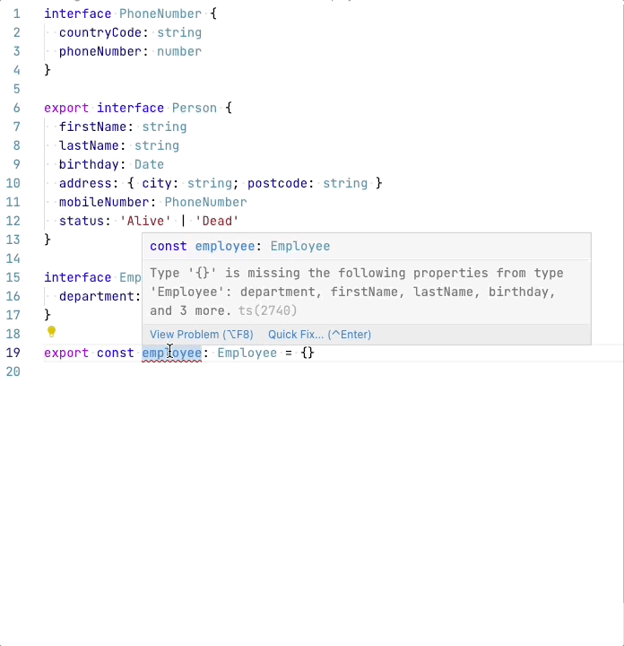
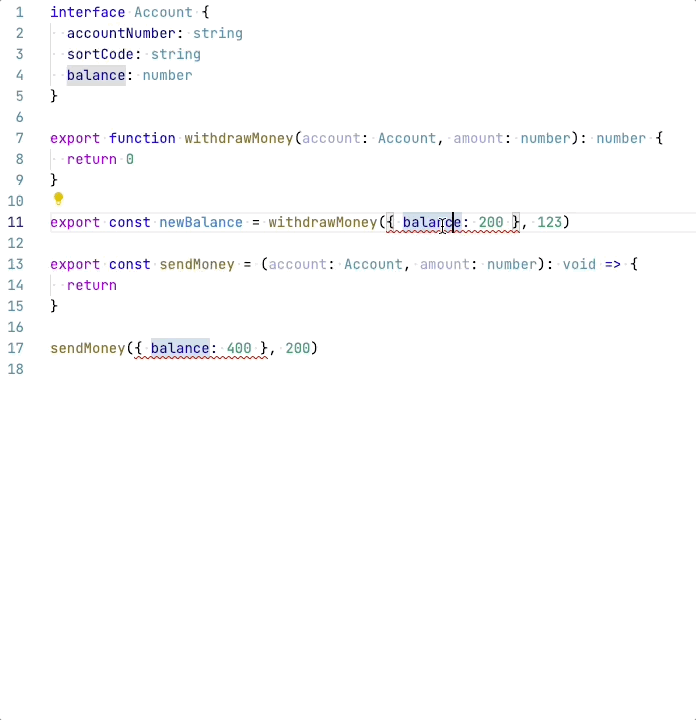
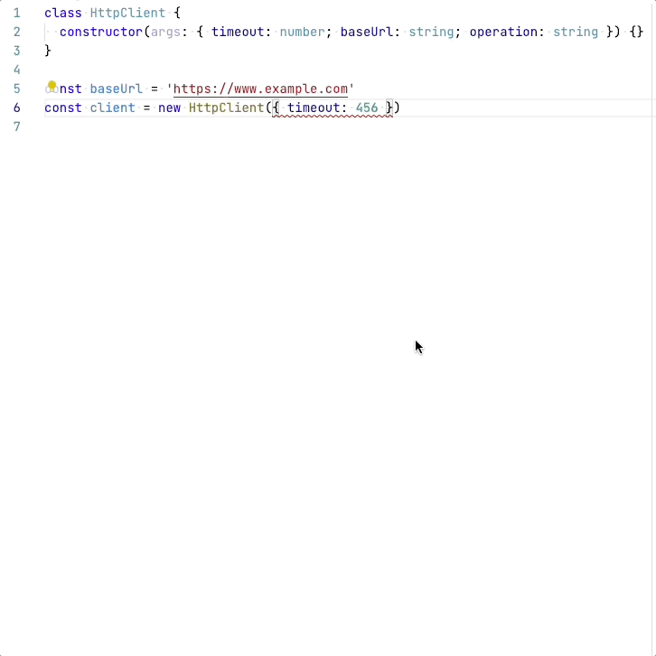

# TS Quickfixes

## Features

### Declare missing members

This fix declares members that are missing from a certain object. It works in the following scenarios including in
situations where a nested object has missing members:

#### Missing variable members

#### Missing argument members

#### Missing constructor argument members

## Requirements

N/A

<!-- If you have any requirements or dependencies, add a section describing those and how to install and configure them. -->

## Extension Settings

N/A

<!-- Include if your extension adds any VS Code settings through the `contributes.configuration` extension point.

For example:

This extension contributes the following settings:

* `myExtension.enable`: enable/disable this extension
* `myExtension.thing`: set to `blah` to do something -->

## Known Issues

If you expect a fix to be available but it isn't, please [open a github issue](https://github.com/tamj0rd2/ts-quickfixes/issues/new) with a small example explaining the issue

### Formatting

This extension/plugin won't do any formatting of generated code. You should
enable an editor option like `formatOnSave` or run a linter to fix the formatting
for you.

## Release Notes

See [CHANGELOG.md](./CHANGELOG.md)

## Contributing

See [CONTRIBUTING.md](https://github.com/tamj0rd2/ts-quickfixes/blob/master/CONTRIBUTING.md)
